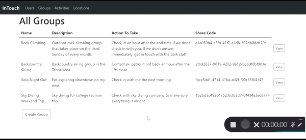

# InTouch

## Description

This project is a full stack CRUD web app that uses Node.js and Express.js as backend with MySQL as the database. The front end is generated using handlebars templating and styled with Bootstrap. The webapp was designed by github user IanFonzie and myself (ramosna).

The goal of InTouch is to create an app that  will help address the problem of group members on an outing getting separated from the group or the entire group getting lost in a location while performing an activity. The goal of the application is to ease some of the uncertainty that comes with doing remote or solo activities. 

Using InTouch, a group could choose to participate in a remote activity, like rock climbing or scuba diving, or an urban activity, like heading out to the bar on their own. Groups can consist of one or more members. In Touch would associate the group with an activity they would like to perform at a particular location and time and a set of contacts, not in the group. Activities have an end time, and if the group is unable to account for members at the end of the activity, alerts will be issued to the contacts notifying them of the situation.

At the moment the application is admin-facing as we wanted to build the database first. The app is currently a work in processes and this is first stage.

For a list of depandecies see the [package.json](package.json) file.

For the backend code and database queries see the [app.js](app.js) file

For the html/handlebars files see the [views](views) folder

## Pages

### Creating Group

#### Add User

#### Add Location

#### Create Activity

#### Create Group

### Navigation

#### Using NavBar

#### Navigating Users

#### Navigating Groups

#### Navigating Activities

#### Navigating Locations

